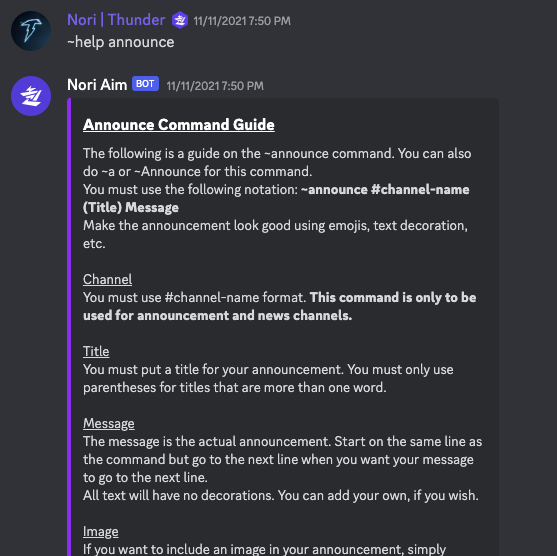

# Discord Bot

### App Description

This bot has various commands available to users which allow for announcements, messages, and database management. Users can access, sort, and update the data directly through discord. They can also run the help command to get more information on specific features.

### App Demo

 

### Features

- Announcement command
- Message command
- Fetch data
- Update data
- Sort data
- Help command
